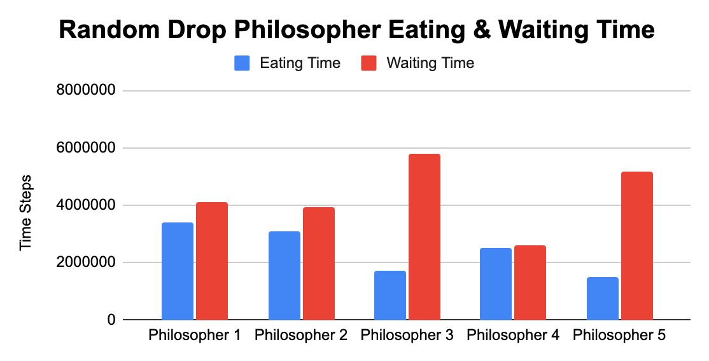
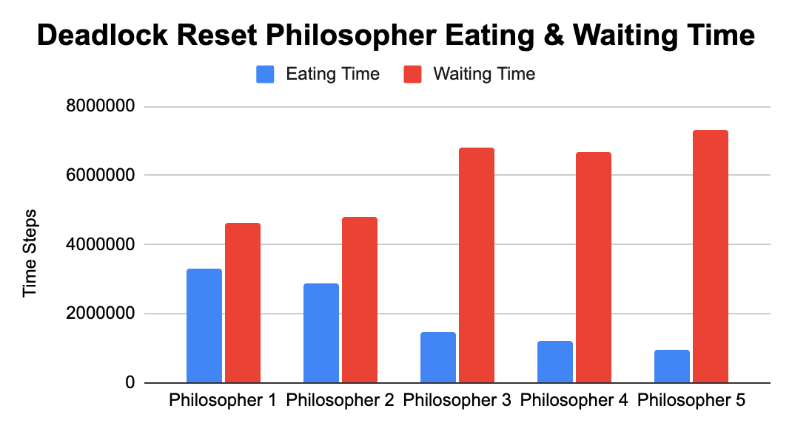
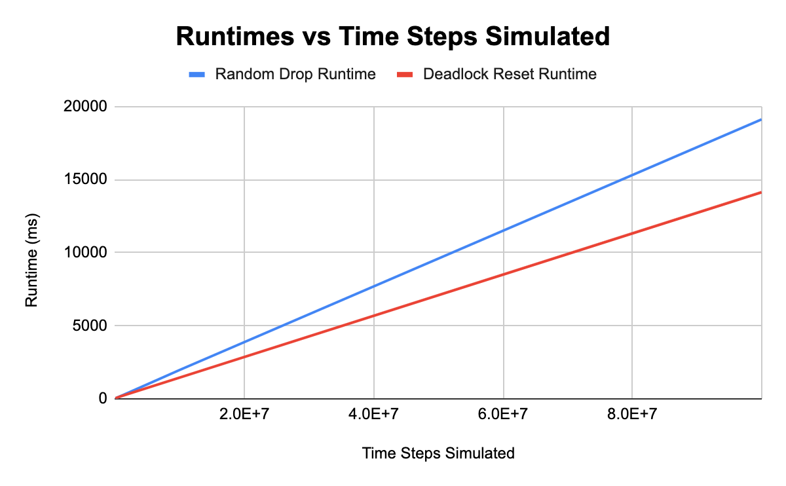

# Dining Philosophers Simulation for CSDS 338
Samuel Bachelor, Michael Seese, Kevin Zhou

## Program Files
- Main.java: runs the simulation
- DropTable.java: random drop method to combat deadlock
- DeadlockTable.java: once deadlock is reached, resets the philosophers

## Output Samples
- dropSample.txt: verbose output for 10000 steps of random drop simulation
- deadlockSample.txt: verbose output for 10000 steps of deadlock recovery simulation
- 100.txt, 1000.txt, ... 100000000.txt: output from the main program for 100 steps, 1000 steps, etc.

## Summary of Results
### One run of the simulation for 10 million time steps produced the following statistics:
- 135,604 resolved deadlocks
- Random drop runtime: 1619ms
- Deadlock reset runtime: 1183ms
##### Random Drop
Philosopher | Eating Time | Waiting Time
----------- | ----------- | ------------
1 | 3403711 (34.04%) | 4095749 (40.96%)
2 | 3089181 (30.89%) | 3920793 (39.21%)
3 | 1713623 (17.14%) | 5780774 (57.81%)
4 | 2505164 (25.05%) | 2607420 (26.07%)
5 | 1491452 (14.91%) | 5161226 (51.61%)

##### Deadlock Reset
Philosopher | Eating Time | Waiting Time
----------- | ----------- | ------------
1 | 3315806 (33.16%) | 4641637 (46.42%)
2 | 2866385 (28.66%) | 4780487 (47.80%)
3 | 1448835 (14.49%) | 6809499 (68.09%)
4 | 1207889 (12.08%) | 6670855 (66.71%)
5 | 963536 (9.64%) | 7307836 (73.08%)

### Analysis
- As can be noted in the charts, using the random drop strategy rather than a deadlock reset significantly reduced the amount of “waiting” time steps in all philosophers with the most drastic  changes observed in the results from Philosopher 4.  Given that we used the second variation of the “Dining Philosophers'' problem from the outlined assignment, we expected to see results outside the norm for Philosopher 3, which was the case for the deadlock reset strategy.  However, we were surprised to see that the most nonconforming data from the random drop strategy stemmed from values for Philosopher 4.  With the deadlock reset strategy we can see that Philosopher 3, who can reach for any chopstick rather than only those adjacent to him, has an uncharacteristic jump in wait time, as well as a significant drop in eating time.  With the exception of Philosopher 3, we can see a steady increase in wait time as well as a decrease in eating time.  With the chaos added from the random drop strategy we still see a pattern of decreasing eating times as we go around the table with a (somewhat expected) deviation from Philosopher 3, however, we then see an increase from Philosopher 4 in eating time as well as a significant decrease in wait time.  Philosopher 5, seemingly affected by the previous two diners, shows values of a highly increased wait time, though with a reduced eating time fitting the expected results.
- Also worth noting is that for each philosopher, a “full probability” was defined, which represented the probability that after a single time step of eating, the philosopher would get full and drop both chopsticks, freeing them up for the other philosophers. For Philosophers 1 through 5, in order, those probabilities were fixed at 0.10, 0.15, 0.20, 0.25, and 0.30. We can clearly see this reflected in the results above, as in both cases, Philosopher 1, with the lowest probability of getting full, had the highest amount of eating time, and vice versa for Philosopher 5.
### Runtimes
- The simulation was run many times using different numbers of time steps (100 steps, 1000 steps, 10000 steps, … 100000000 steps), and each produced very similar results, proportional to the number of steps, with some small variations.  We then made a line plot (shown below) of runtimes against the number of time steps simulated to show how the two strategies scale as time progresses.

## Contributions
Samuel and Kevin collaborated on writing most of the code for the simulation, Michael completed the write-up and analysis of the results, and Kevin compiled everything into a repository for easy viewing.
